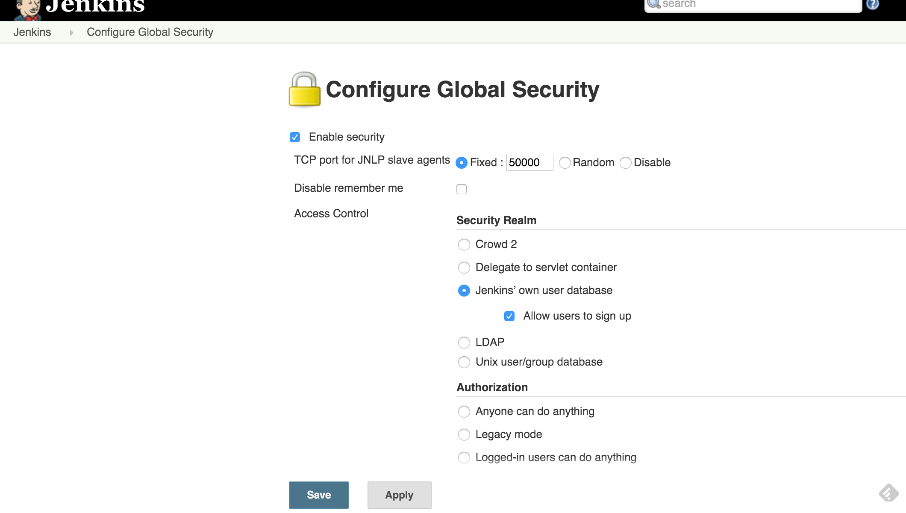
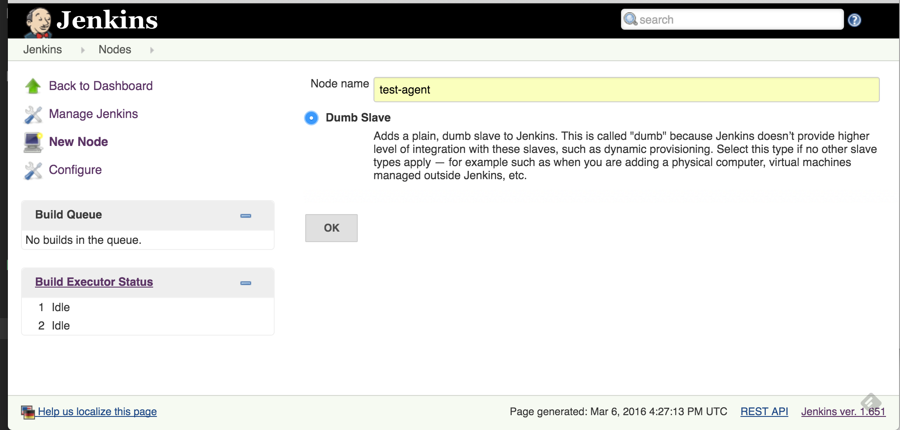
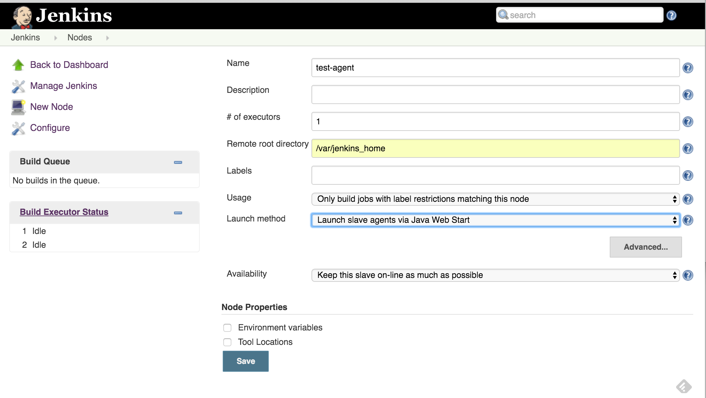
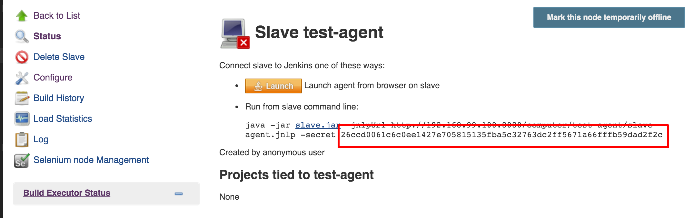

# Containerized build environments with the Jenkins Pipeline plugin and Docker.
This code is related to this blog post:

http://damnhandy.com/2016/03/06/creating-containerized-build-environments-with-the-jenkins-pipeline-plugin-and-docker-well-almost/

This project demonstrates how one could use the [Jenkins Pipeline/Workflow plugin](https://github.com/jenkinsci/workflow-plugin) and Docker to create containerized build environments. Please note that NOT everything in this project works as desired. It's an absolute work-in-progress.  

## Starting the Jenkins Master
The Jenkins master is not set up to save state. To start it, do the following:

	cd jenkins-master && docker-compose up

The Jenkins master will be available at [http://192.168.99.100:8080](http://192.168.99.100:8080) . Before bringing up the agent, there's a few steps to setting up Jenkins. First, set up security so that users have to login and enable the JNLP agents.

Next, go to "Manage Jenkins" and look for "Manage Nodes" and create a new slave called "test-agent"

Setup the new agent with a remore directory of `/var/jenkins_home` and set the launch method to JNLP:

Once the node is created, click agent name to reveal the `-secret`:

Copy this value so you can pass it to the agent.

## Starting the Jenkins Agent

Execute the following:

	cd jenkins-jnlp-agent
	export JENKINS_SECRET="the-value-you-copied-earlier" | docker-compose up

You should now see the agent on the main screen.

## Adding Jobs

The Jobs folder contains 3 Groovy scripts that define different pipelines. These jobs are here to represent what is working and what isn't. Here's what they do and the expected outcomes of each:

  * `jobs/sans-docker.groovy`: Executes the build in on the test agent container without running inside a docker container. This pipeline works and the project build successfully.
  * `jobs/docker-inside.groovy`: This is my ideal state but this doesn't work at all and this will hang indefinately due to the fact that the build container can't see the volume. This pipeline does work if the agent is not in a container.
  * `jobs/docker-in-shell.groovy`: This pipeline demonstrates that it is possible to get `docker.inside()` to work if using a data volume container. The pipeline partially works and it can see code, but the build fails on updating the git submodule.

  I didn't have a great way providing a Jenkins master with pre-configured jobs. Thus, you'll have to create each job manually. 
